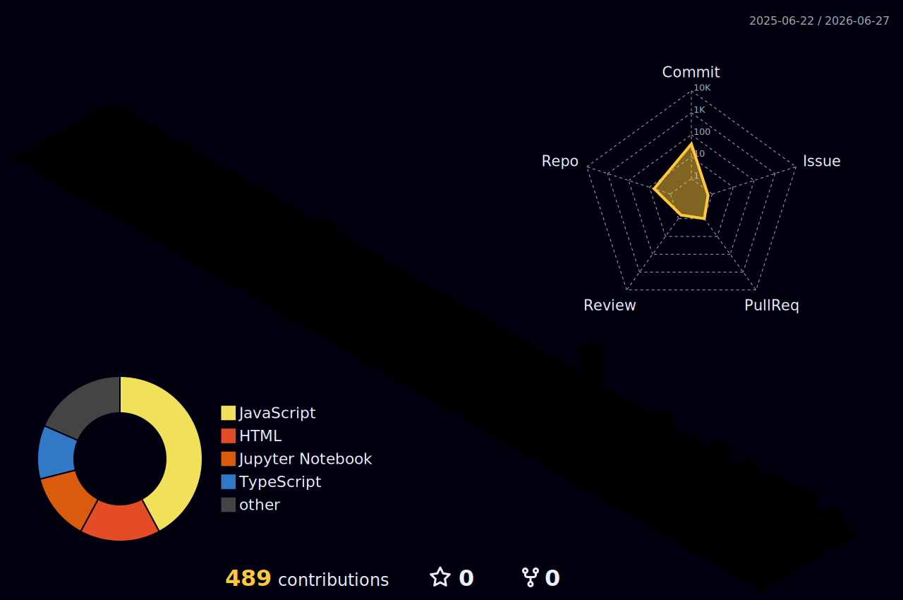
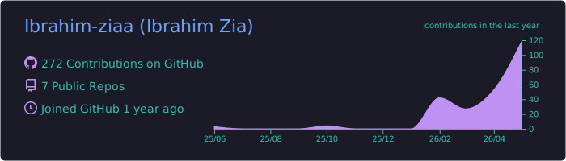
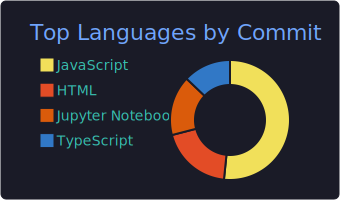
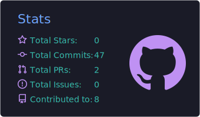
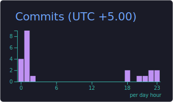

<div align="center">

<a href="https://github.com/Ibrahim-ziaa">
  
</a>

<a href="https://github.com/Ibrahim-ziaa">
  
</a>

<br/>

<a href="https://teamnebula.ai">
  
</a>
<a href="https://www.linkedin.com/in/YOUR-LINKEDIN-HANDLE/">
  
</a>
<a href="mailto:ziaibrahim90@gmail.com">
  
</a>
<a href="https://github.com/Ibrahim-ziaa">
  
</a>


</div>

---

### About Me

```python
class IbrahimZia:
    def __init__(self):
        self.name         = "Ibrahim Zia"
        self.nationality  = "Pakistani"
        self.roles        = ["Data Scientist", "AI Engineer", "ML Engineer", "Software Engineer"]
        self.focus        = ["LLM agents", "RAG pipelines", "MLOps", "explainable AI"]
        self.currently    = "Director of ML & DS @ Team Nebula AI"
        self.education    = "B.S. Data Science, FAST-NU Lahore (graduated)"
        self.hobbies      = ["cricket", "chess", "golf", "reading", "gaming"]
        self.ask_me_about = ["AI/ML systems", "data pipelines", "system design"]

    def say_hi(self):
        print("I build AI systems that are explainable, reliable, and actually useful.")
```

I build AI systems that work in production — multi-agent architectures, RAG pipelines, LLM integrations, and ML models that go from notebook to deployed product. My background spans data science research and hands-on engineering, which means I care about both model quality and system reliability.

**Currently focused on**
- **LLM systems**: RAG pipelines, NL-to-SQL agents, tool-calling workflows, evaluation frameworks
- **ML engineering**: anomaly detection, time-series forecasting, explainable AI (SHAP)
- **AI automation**: n8n, Make, GHL — workflow automation that connects LLMs to real business processes

---

### Selected Projects

| Project | What It Does | Stack |
|---|---|---|
| [DExPhish](https://github.com/Ibrahim-ziaa/dexphish-xai-phishing-detection) | Explainable phishing detection via XLM-RoBERTa + HTML features + SHAP | Transformers, SHAP, BeautifulSoup |
| [Skin Cancer Detection](https://github.com/Ibrahim-ziaa/skin-cancer-lesion-segmentation) | Multimodal CNN + metadata fusion — Kaggle rank 35, 98% accuracy | PyTorch, EfficientNet, CatBoost |
| [Multimodal Meme Search](https://github.com/Ibrahim-ziaa/multimodal-meme-search) | Semantic image retrieval via text embeddings (TF-IDF, CBOW, Skip-Gram) | Gensim, scikit-learn |
| [HCT Survival Prediction](https://github.com/Ibrahim-ziaa/HCT-survival-prediction) | Clinical tabular ML for post-transplant survival outcomes | LightGBM, XGBoost, CatBoost |

---

### Experience

- **Director of ML & Data Science** · Team Nebula AI
- **AI Automation Specialist** · Upwork (Top Rated)
- **B.S. Data Science** · FAST-NU Lahore (graduated)

---

### Tech Stack

**Languages**
<p>
  
  
  
  
  
</p>

**AI / ML**
<p>
  
  
  
  
  
  
  
  
  
  
  
</p>

**Frontend**
<p>
  
  
  
  
</p>

**Backend**
<p>
  
  
  
  
</p>

**Data & Cloud**
<p>
  
  
  
  
  
  
  
  
</p>

**Automation**
<p>
  
  
  
</p>

---

### GitHub in 3D

<div align="center">
  
</div>

---

### Stats at a Glance

<div align="center">
  
  
</div>

<div align="center">
  
  
</div>

<div align="center">
  
</div>

---

### Contribution Activity

<div align="center">
  
</div>

<picture>
  <source media="(prefers-color-scheme: dark)" srcset="https://raw.githubusercontent.com/Ibrahim-ziaa/Ibrahim-ziaa/output/github-contribution-grid-snake-dark.svg"/>
  <source media="(prefers-color-scheme: light)" srcset="https://raw.githubusercontent.com/Ibrahim-ziaa/Ibrahim-ziaa/output/github-contribution-grid-snake.svg"/>
  
</picture>

---

### Trophy Cabinet

<div align="center">
  
</div>

---

<div align="center">
  <i>Building AI systems that are explainable, reliable, and actually useful.</i>
  <br/><br/>
  
</div>
